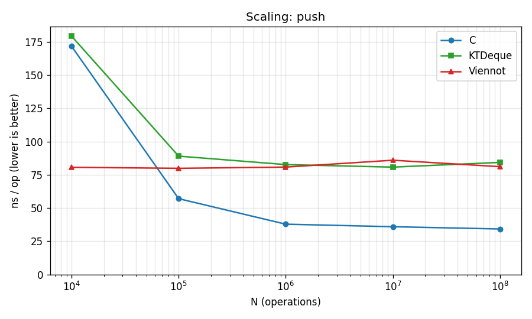
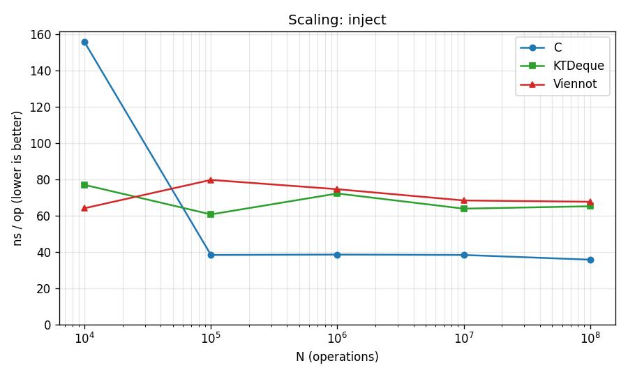
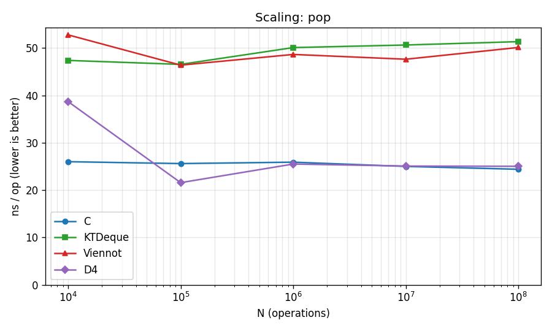
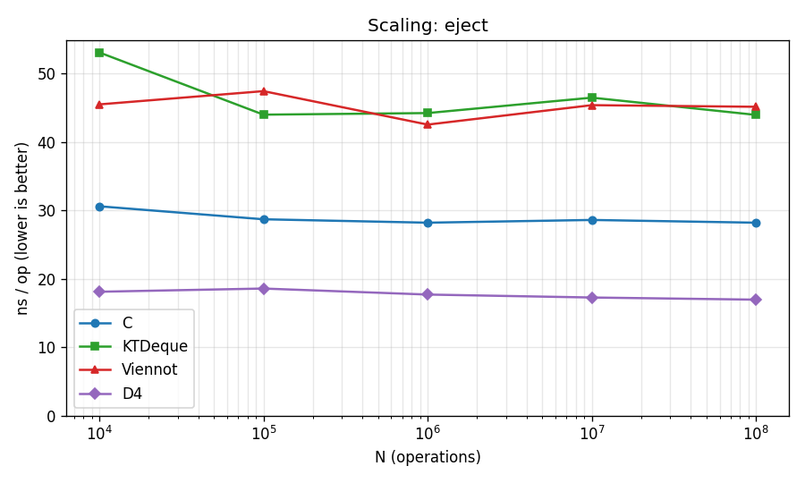
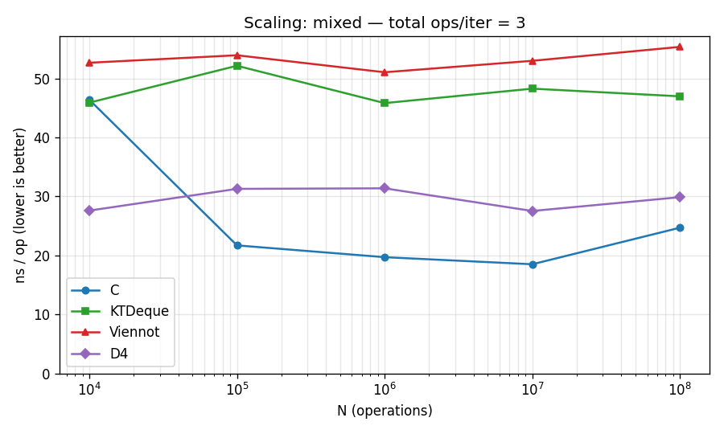
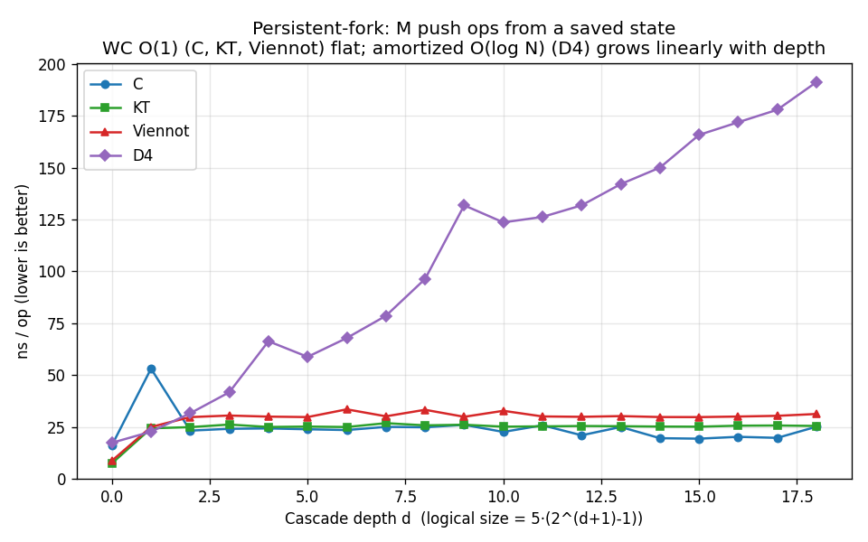

# bench/ — top-level reproducible benchmarks

Two head-to-head benchmarks live here.  Both are designed to be **easy
to audit** (single shell script per benchmark, no hidden state) and
**easy to reproduce** (one make target each, environment fingerprint
embedded in every result file).

| Benchmark                | What it compares                                                                 | Run via                       |
| ------------------------ | -------------------------------------------------------------------------------- | ----------------------------- |
| [`three-way.sh`](three-way.sh)   | Our **C** vs our **OCaml** (extracted) vs **Viennot OCaml** at one fixed N        | `make bench-three-way`        |
| [`canonical.sh`](canonical.sh)   | Our verified ktdeque vs canonical-style alternatives, à la Viennot et al. PLDI'24 | `make bench-canonical`        |
| [`sweep.sh`](sweep.sh)           | C / KTDeque / Viennot / **D4** swept over N from 10⁴ to 10⁸; renders PNG plots    | `make bench-sweep`            |
| [`adversarial.sh`](adversarial.sh) | Persistent-fork microbench: forces D4's worst case per op, isolates WC vs amortized | `make bench-adversarial`    |

Both scripts:

- build their prerequisites from this repo's source tree (no opam
  install required);
- print the unified Markdown table to stdout;
- save the same table to `bench/results/<bench>-YYYY-MM-DD.md`
  (gitignored — fresh on every run);
- record the kernel, gcc / OCaml versions, and date in the report header
  for reproducibility.

## `three-way.sh` — C / OCaml / Viennot

Runs **the same workload battery** (push N, inject N, pop N, eject N,
mixed = push / push / pop) at n=1,000,000 against three implementations:

1. **Our C** — `c/src/ktdeque_dequeptr.c`, with arena compaction at
   `KT_COMPACT_INTERVAL=4096` (the default).  Built by `make -C c bench`.
2. **Our OCaml extracted from Rocq** — `ocaml/extracted/`, library
   `ktdeque`.  Built by `dune build _build/default/ocaml/bench/compare.exe`.
3. **Viennot OCaml** — vendored at `ocaml/bench/viennot/`, the
   hand-written real-time deque from VWGP PLDI'24.

The OCaml side runs the two OCaml implementations in the same process
(`compare.exe`); the C side runs as a subprocess.  Output is parsed and
unified into one ns/op table with a `C vs Viennot` speedup column.

Override the size with `N=…`:

```sh
N=100000 make bench-three-way
```

## `canonical.sh` — vs canonical alternatives

Runs **a richer workload mix** (steady push, steady inject, drain,
alternating push/pop, mixed P/I/Po/Po, fork-stress) at three sizes
(default 1k / 10k / 100k) against four implementations:

| Tag    | What                                                              | Asymptotic per-op |
| ------ | ----------------------------------------------------------------- | ----------------- |
| **KT**  | Our verified extraction (`KTDeque.push_kt2 / pop_kt2 / …`)        | WC O(1)           |
| **Vi**  | Viennot OCaml (vendored, hand-written)                            | WC O(1)           |
| **D4**  | Our hand-written `Deque4` (`Ktdeque_bench_helpers.Deque4`)        | amortized O(log n)|
| **Ref** | List-based reference (`Ktdeque_bench_helpers.Deque4_ref`)         | O(1) push/pop, O(n) inject/eject |

`Ref` is the algorithmic baseline (a `'a list` with `(::)` for push and
`@ [_]` for inject).  It is included on workloads where its O(n)
inject doesn't dominate runtime.  Cells marked `—` mean the row was
skipped to keep the bench tractable.

The framework lives in
[`ocaml/bench/canonical.ml`](../ocaml/bench/canonical.ml) — a
`module type DEQUE` and a `Workloads` functor — designed so adding a
new canonical implementation (e.g. an Okasaki banker's deque, a
Hood-Melville real-time deque) is ≈ 30 lines: write the adapter,
register it in the bench loop.

Override the sizes with `SIZES="…"`:

```sh
SIZES="100 1000 10000" make bench-canonical
```

## What's *not* here (yet)

The two benches above cover what's currently vendored.  Mirroring
Viennot's full §9 experiments would also include:

- **Okasaki banker's deque** (purely functional, amortized).  Not
  vendored.  Adding it is a known, small task — the `DEQUE` module
  type in `canonical.ml` is the slot.
- **Hood-Melville real-time deque** (the classical purely-functional
  WC O(1) deque from before KT99).  Not vendored.
- **JVM/F# competing implementations**, if a cross-language comparison
  matters for the paper context.

Pull requests welcome.  The cleanest extension path is adding a new
adapter module to `canonical.ml` and a row in its workload table.

## Example results from a single run

> Snapshot from one run of each bench.  Single-process,
> single-threaded; **not statistically post-processed**.  Re-running
> on the same machine reproduces these to within run-to-run variance
> (roughly ±10%).  See the reproducibility checklist below for what
> to do before quoting any of these in a paper.

**Machine**: Linux 6.17.12+deb14-amd64 x86_64, gcc 13.3.0, OCaml 5.4.1.

### `bench-three-way` (n = 1,000,000)

ns/op (lower is better).  Speedup column is Viennot OCaml ÷ C.

| Op      | C (K=4096) | KTDeque (extracted OCaml) | Viennot OCaml | C vs Viennot |
| ------- | ---------: | ------------------------: | ------------: | -----------: |
| push    |     31.3   |      81.0                 |      84.8     | **2.71×**    |
| inject  |     35.9   |      78.8                 |      81.4     | **2.27×**    |
| pop     |     25.8   |      54.5                 |      54.3     | **2.10×**    |
| eject   |     32.1   |      53.3                 |      49.7     | **1.55×**    |
| mixed   |     18.8   |      49.1                 |      66.7     | **3.55×**    |

The C with arena compaction (K=4096) wins on every workload.  The two
OCaml columns (verified extraction vs Viennot's hand-written reference)
are within ~10% of each other on every op — both implement the same
WC-O(1) algorithm class and run in the same OCaml runtime.

### `bench-canonical` (n = 100,000 iters)

ns/op for each implementation across workloads.  Lower is better;
ratio columns are vs Viennot.  `—` means the implementation was
skipped because its asymptotic cost would dominate runtime
(`Ref.inject` is O(n) → O(n²) total at this size).

| Workload        |  iters  |    KT   |    Vi   |    D4   |   Ref   | KT/Vi | D4/Vi | Ref/Vi |
| --------------- | ------: | ------: | ------: | ------: | ------: | ----: | ----: | -----: |
| steady_push     | 100 000 |    65.2 |    73.5 |    56.2 |    20.8 |  0.89 |  0.76 |  0.28  |
| steady_inject   | 100 000 |    61.1 |    63.8 |    52.0 |     —   |  0.96 |  0.81 |   —    |
| drain           | 100 000 |    58.9 |    52.4 |    36.1 |    12.3 |  1.12 |  0.69 |  0.23  |
| alt_push_pop    | 100 000 |     9.2 |     8.1 |     5.8 |     3.3 |  1.13 |  0.71 |  0.41  |
| mixed_pipopo    | 100 000 |     9.0 |     8.8 |     7.0 |     —   |  1.02 |  0.80 |   —    |
| fork_stress     | 100 000 |    35.5 |    39.7 |    30.6 |     5.8 |  0.89 |  0.77 |  0.15  |

What the table is saying:

- `KT` (verified extraction, kt2 family) and `Vi` (Viennot's hand-written
  reference) are roughly tied on every workload — KT is within ~12% of
  Vi everywhere.  Both are WC O(1).
- `D4` (our hand-written amortized-O(log n) variant) is faster than KT
  and Vi at this size on push/pop because its bookkeeping is cheaper
  per-op when cascades are rare; the WC-O(1) machinery only pays off
  when an adversarial pattern forces deep cascades.
- `Ref` (a `'a list` with O(n) inject/eject) crushes the others on
  push-only and pop-only workloads (cons/uncons is the cheapest
  possible op).  It's there as the algorithmic baseline, not as a
  competitor.
- The `alt_push_pop` row is the classic adversarial workload Viennot's
  paper highlights: at constant size 0–1, the per-op overhead
  dominates, so all implementations look fast and close together.

The full canonical run also produces tables at n=1000 and n=10000;
see `bench/results/canonical-YYYY-MM-DD.md` after running the bench
yourself.

### `bench-sweep` (N from 10⁴ to 10⁸)

`make bench-sweep` varies N over five orders of magnitude and renders
PNG plots showing ns/op vs N for each (op × impl).  Four lines per
plot:

- **C** — our C library (`libktdeque.a`), arena compaction at K=4096.
- **KTDeque** — verified Rocq extraction (`push_kt2 / pop_kt2 / …`).
- **Viennot** — Viennot's hand-written WC-O(1) reference.
- **D4** — our hand-written *amortized* O(log n) variant
  (`Ktdeque_bench_helpers.Deque4`), included as the contrast against
  WC O(1).

Workload pattern is **sequential build**: each operation uses the
result of the previous one, the deque grows from 0 to N elements, and
all N intermediate states stay live in the heap.  Per-op numbers are
therefore the *amortized* cost of growing a deque, including OCaml
major-heap and C arena pressure as the structure accumulates — not
the cost of one operation in isolation.  See
[`bench-adversarial`](#bench-adversarial-persistent-fork-microbench)
for the single-op-in-isolation measurement.

Flat lines are the WC O(1) signal: per-op cost does not grow with N.

The plots below were rendered from a single run on this machine
(committed snapshots — re-running `make bench-sweep` overwrites them
in `bench/plots/`):

| Op       | Plot                                                  |
| -------- | ----------------------------------------------------- |
| push     |                        |
| inject   |                    |
| pop      |                          |
| eject    |                      |
| mixed    |                      |

Numbers from the same run (ns/op, lower is better):

| N           |     C push |  KT push |  Vi push |  D4 push |
| ----------: | ---------: | -------: | -------: | -------: |
|      10,000 |     139.4  |    62.2  |    61.0  |    54.2  |
|     100,000 |      53.1  |    76.2  |   101.7  |    66.5  |
|   1,000,000 |      37.8  |    82.9  |    96.3  |    74.0  |
|  10,000,000 |      35.3  |    84.9  |    90.6  |    79.1  |
| 100,000,000 |      33.2  |    88.1  |    87.8  |    78.8  |

Both binaries now run a small warmup loop (1000 ops per impl) before
the timed measurements, so the N=10⁴ numbers reflect steady-state
per-op cost rather than first-touch / page-fault startup overhead.
(C push at N=10⁴ is still slightly elevated because the C arena's
first chunk allocation happens inside the timed loop — a residual
that doesn't affect any larger N.)  Each implementation's per-op
cost is flat across the four orders of magnitude — exactly the
empirical fingerprint of worst-case O(1).  The full table at all 5
ops × 5 sizes (push, inject, pop, eject, mixed) lives in
`bench/results/sweep-YYYY-MM-DD.md` after a run.

#### What about D4's O(log n) drift?

D4 is amortized O(log n) per op, so its line *should* drift upward
with N.  In practice the drift is invisible on these scaling plots:
push N elements through D4 sequentially and the cascades amortize
across the whole sequence, so the per-op average stays near constant.
To force the divergence you need an adversarial workload that *defeats
the amortized analysis*.  See [`bench-adversarial`](#bench-adversarial-persistent-fork-microbench)
below — it shows D4 paying 7× the per-op cost of KT at depth 18.

What the scaling data *does* show:

- **All four lines stay flat** from N=10⁵ on.  C wins everywhere; KT
  and Vi are within ~5%; D4 is comparable on push and *faster* on
  pop/eject (~25 ns vs ~50 ns).
- **D4's pop/eject advantage is the structural cost of WC O(1)**:
  KTDeque's chain-coloring discipline pays a fixed per-op overhead
  on the simple paths so that the *adversarial* worst case is
  bounded.  D4 has no such bookkeeping, so the common case is faster
  — but its worst-case op is unbounded by N.

### `bench-adversarial` (persistent-fork microbench)

`make bench-adversarial` runs a workload designed to *break* D4's
amortized analysis.  The amortized argument says "average over a
sequence of M operations on the *same evolving structure*".  It does
NOT bound a single operation: D4's worst-case op is O(log N).

Persistence breaks the amortization: take a saved state s, apply M
push operations using s as the LHS each time.  Each call returns a
new deque; s is unchanged.  No credits carry across calls — every
single call pays its own state-dependent worst-case cost.

> **Why these numbers don't match `bench-sweep`'s "push" row.**  The
> sweep measures *sequential build* (each push uses the result of the
> previous, all intermediate states stay live).  This bench measures
> *persistent fork* (every iteration starts from the same saved
> state, the result is discarded).  These are two genuinely different
> workloads; they answer two different questions.  D4 looks fast on
> the sweep because amortization works (~80 ns at N=10⁸) and slow
> here because amortization fails (~190 ns at N≈2.6M).  KT and Vi
> look slower on the sweep (~85 ns at N=10⁸) and faster here (~25-30
> ns) because the sweep's kept-result chain accumulates heap pressure
> while this bench's discarded results stay in the OCaml minor heap.
> The sweep tells you "what does the everyday `for i := …` cost"; the
> adversarial bench tells you "what does *one* push on a saved state
> cost — the worst case the WC-O(1) bound was designed to bound".

All four implementations are built the same way: N sequential pushes
from empty.  We pick N = 5*(2^(d+1)-1) — sizes where sequential build
deterministically lands at a state from which one more push triggers
a Θ(d) cascade in D4.  Every state in the bench is therefore reachable
from empty.  KT, Vi and the C library are state-independent (WC O(1))
so any state of size N suffices for them.



Sample numbers from this machine (ns/op; lower is better):

| Depth |     Size  |  C   |  KT  |  Vi  |  D4   | KT/D4 ratio |
| ----: | --------: | ---: | ---: | ---: | ----: | ----------: |
|     0 |        5  | 16.2 |  7.4 |  8.7 |  17.4 |     0.4×    |
|     4 |      155  | 24.3 | 25.0 | 30.0 |  66.3 |   **2.7×**  |
|     8 |    2,555  | 24.9 | 25.8 | 33.3 |  96.4 |   **3.7×**  |
|    12 |   40,955  | 21.0 | 25.5 | 29.9 | 131.9 |   **5.2×**  |
|    16 |  655,355  | 20.3 | 25.6 | 30.0 | 171.9 |   **6.7×**  |
|    18 | 2,621,435 | 25.1 | 25.5 | 31.3 | 191.3 |   **7.5×**  |

What the table is saying:

- **C, KT and Viennot are all flat across depth** (~22, ~25, ~30 ns
  respectively).  Three independent WC-O(1) implementations giving
  the same empirical fingerprint: per-op cost is genuinely state-
  independent, exactly what the proofs guarantee.
- **D4's per-op cost grows linearly with cascade depth** (~ +10 ns
  per level).  At depth 18 the structure has cascaded 18 times
  deep, so each persistent push redoes ~18 levels of work.
- **The ratio grows with N**: 2.7× at depth 4, 7.5× at depth 18
  (≈ 2.6M elements).  Asymptotically unbounded — that's the formal
  content of "amortized O(log n) ≠ worst-case O(1)".

The story this plot tells is *operational*: same workload, same
persistence, all states reachable from empty by ordinary pushes, yet
observably different scaling per-op.

##### A note on the C arena and persistence

The persistent-push pattern is unusual: every iteration allocates a
new chain link whose result we immediately discard.  Without
intervention M=200k iterations would leak ~10 MB of dead links into
the C arena, spilling the working set out of L2 and adding
memory-system noise that has nothing to do with per-op cost.  OCaml's
minor GC reclaims discarded results during the loop implicitly; in C
we ask for it explicitly with `kt_arena_compact` every 4096 iterations.
Compaction time is excluded from the per-op measurement.  This is a
realistic usage pattern — long-running C programs that hold persistent
deques are expected to compact periodically; see the production region
API (`kt_region_*`) for the same idea integrated with explicit lifetimes.

#### Why we cap N at 10⁸ on a 62 GB box

The C library's arena, even with `K=4096` compaction, retains the
*live* persistent deque structure: ~30 bytes per element across
chain links and packet buffers.  At N=10⁸ that is ~3 GB for the
deque plus 0.8 GB for the user-payload `g_storage[N]` array, plus
working space — total peak RSS ~8 GB, fits comfortably.

At N=10⁹ the deque alone climbs to ~30 GB and the OS
OOM-kills the process on a 62 GB machine.  This is structural, not
a bug: a persistent deque with 10⁹ live elements *needs* somewhere
to store 10⁹ pointers.  The WC-O(1) bound is on per-op cost, not on
total memory.  On a workstation with ≥ 96 GB RAM, override `SIZES`:

```sh
SIZES="10000 100000 ... 1000000000" bench/sweep.sh
```

#### Plot generation

`bench/sweep.sh` writes a CSV (`n,op,impl,ns_per_op`) to
`bench/results/sweep-YYYY-MM-DD.csv` and invokes
[`bench/plot.py`](plot.py), which uses matplotlib to render one PNG
per op.  Both the CSV and the matplotlib library are cleanly
separated — you can replot without re-running the bench:

```sh
python3 bench/plot.py bench/results/sweep-YYYY-MM-DD.csv \
    bench/plots /tmp/summary.md
```

## Reproducibility checklist

Before quoting numbers from these benches in a paper or README, please:

1. Run each bench at least 5 times and report median ± stddev.  Each
   script reports a single run with no statistical post-processing.
2. Fix the CPU governor (`sudo cpupower frequency-set -g performance`)
   and turn off turbo if the variance is high.
3. Pin to a single core (`taskset -c 0 …`).
4. Note the exact gcc / OCaml versions; the report header records them
   for you.
5. The C side defaults to `-O3 -funroll-loops -finline-functions
   -fomit-frame-pointer -DNDEBUG -DKT_COMPACT_INTERVAL=4096`.  The
   OCaml side uses dune's default profile (release-equivalent).  Both
   are visible in the report header.

For the everyday "is the perf number still in the right ballpark?"
check, a single run is fine.
